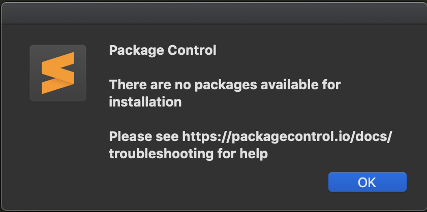

# sublime text 3 channels backup

## Why create this

When we install sublime plugins, we may get the error like this.


WTF. Open the sublime console. we can get the detail error message. 


The sublime can't download the channel file. The channel file records 
all the plugins's info, like version, repo url. So if we wanna install 
plugins, we must make sure the sublime has downloaded this file into its 
plugin folder. In consideration of the complicated network connection, I 
make a backup of this file. I will update it occasionally.

## How to use it

On Mac, you just do as the following.

`Preferences > Package Settings > Package Control > Settings - User`

Open the file, then add 

```
 "channels":
    [
        "https://github.com/mrmign/sublime_channels/blob/master/channel_v3.json",
    ],
```
